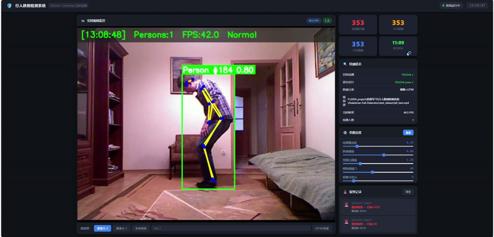
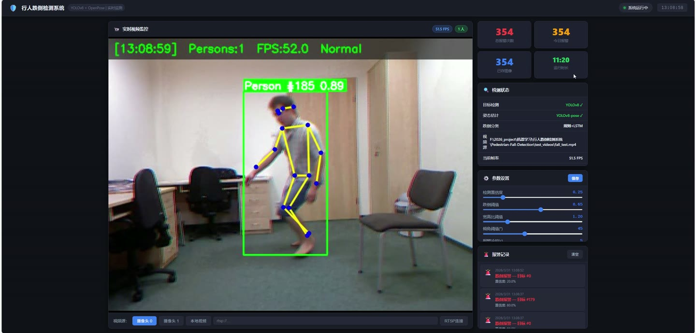
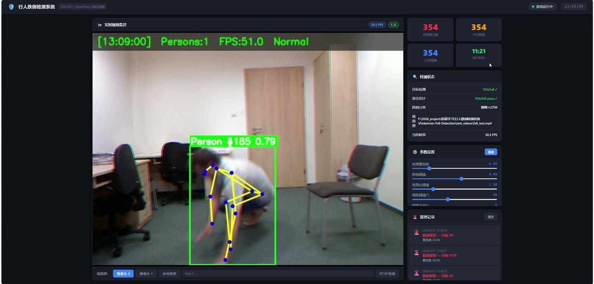
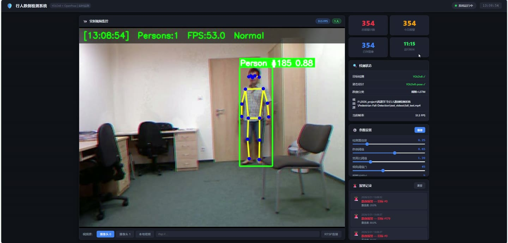
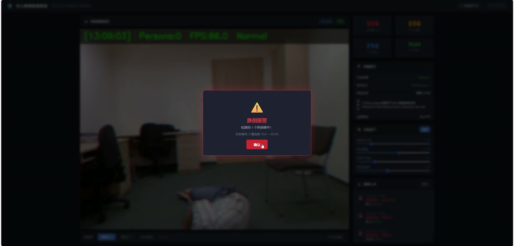
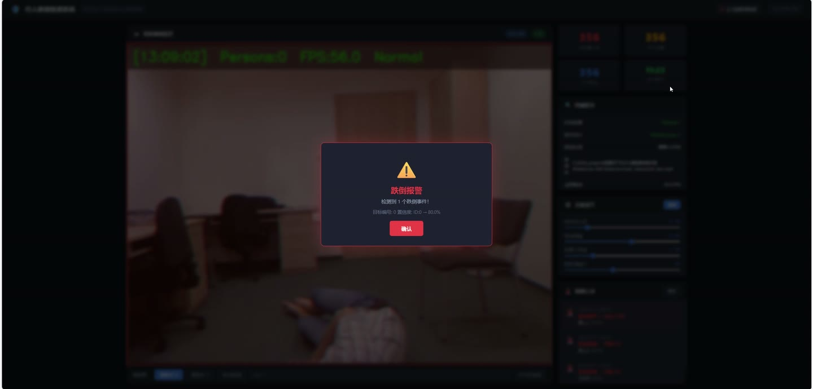

# (附文档)Python+YOLO+深度学习 行人跌倒检测系统

**技术栈**：Python、Flask、PyTorch、YOLO、深度学习

### 系统简介

本系统是一套基于 Python + Flask + PyTorch + YOLO 深度学习构建的行人跌倒检测系统，采用前后端分离架构，后端通过 Flask 提供 MJPEG 视频流与 REST API 接口，前端页面通过 WebSocket 实时接收检测状态推送。系统集成 YOLOv8 行人检测、YOLOv8-Pose 姿态估计、时序特征提取与跌倒分类器，实现从视频采集、目标跟踪、姿态分析到报警触发的完整闭环。系统包含普通用户端与管理员端两类角色，支持摄像头、本地视频文件、RTSP 流等多种视频源接入。
 
### 核心功能
 
### 普通用户端

 
- 实时视频监控：通过 MJPEG 流在浏览器中查看带标注的检测画面，画面叠加时间戳、人数、FPS 与状态提示。 
- 跌倒状态可视化：在检测画面上绘制行人检测框、骨骼关键点连线，跌倒目标以红色高亮并显示置信度分数。 
- 实时报警推送：通过 WebSocket 接收 fall_alert 事件，展示报警时间、目标 ID 列表与对应置信度分数。 
- 系统状态查看：通过 /api/status 接口实时获取 FPS、当前人数、是否检测到跌倒、检测模式、视频源与运行时长。 
- 视频源切换：通过 /api/source 接口在摄像头 ID、本地视频文件、RTSP 流之间切换，切换失败时自动回退至原视频源。 
- 视频文件上传：通过 /api/upload 接口上传 mp4/avi/mov/mkv/wmv/flv/webm 格式视频并自动切换为检测源。 
- 报警记录查看：通过 /api/alerts 接口按数量获取最近报警记录，包含时间、目标 ID、置信度与截图路径。 
- 报警截图浏览：通过 /alerts/<filename> 路由直接访问报警时刻保存的现场截图。 
- 报警记录清空：通过 /api/alerts/clear 接口一键清空当前报警历史列表。 
- 检测参数调节：通过 /api/settings 接口读取与修改检测置信度、跌倒置信度、宽高比阈值、身体倾角阈值与报警冷却时间。
 
### 管理员端

 
- 检测主循环管理：后台线程运行 detection_loop，按帧采集视频并控制推理频率（每 2 帧推理一次）。 
- 行人检测与跟踪：调用 YOLOv8 检测模型对画面中的行人进行检测与 ID 跟踪，输出边界框与跟踪 ID。 
- 姿态估计处理：对每个行人 ROI 调用 YOLOv8-Pose 提取 17 个 COCO 关键点坐标与置信度。 
- 特征提取与跌倒判定：从姿态结果中提取 20 维特征向量，结合时序窗口与规则阈值输出跌倒状态与分数。 
- 报警触发与冷却控制：对判定为跌倒的目标触发报警，按 ALERT_COOLDOWN_SEC 控制同一目标报警冷却时间。 
- 报警截图保存：报警触发时保存现场画面至 alerts 目录，并限制最多保存 500 张报警图片。 
- 系统日志记录：将运行日志同时输出到控制台与 logs/system.log 文件，按时间与级别格式化记录。 
- 视频源自动选择：启动时按命令行参数、本地测试视频、摄像头 0 的优先级自动尝试启动视频源。 
- 检测参数配置：通过 config.py 集中管理模型路径、检测阈值、姿态阈值、跌倒阈值、帧率与训练超参数。 
- WebSocket 连接管理：处理客户端 connect/disconnect 事件，连接建立时主动推送一次当前系统状态。
 
### 技术栈

 后端框架Flask 实时通信Flask-SocketIO 深度学习框架PyTorch 目标检测模型YOLOv8n 姿态估计模型YOLOv8n-Pose（17 关键点） 跌倒分类模型LSTM 时序分类器（fall_classifier.pth） 图像处理OpenCV 数值计算NumPy 前端模板Jinja2（index.html） 视频流协议MJPEG（multipart/x-mixed-replace） 数据存储本地文件系统（报警截图、日志、模型权重）
 
### 交付内容

 
- 后端完整源码 
- 前端完整源码 
- 数据库初始化脚本 
- 万字文档

## 界面展示

---

## 获取完整源码 + 万字文档

本仓库为项目介绍页。**完整前后端源码、数据库初始化脚本、万字项目文档**，请加微信 `kangkangcode`，或访问 [codekk.top](http://codekk.top) 获取。

可作课程设计 / 毕业设计参考，支持远程部署调试。